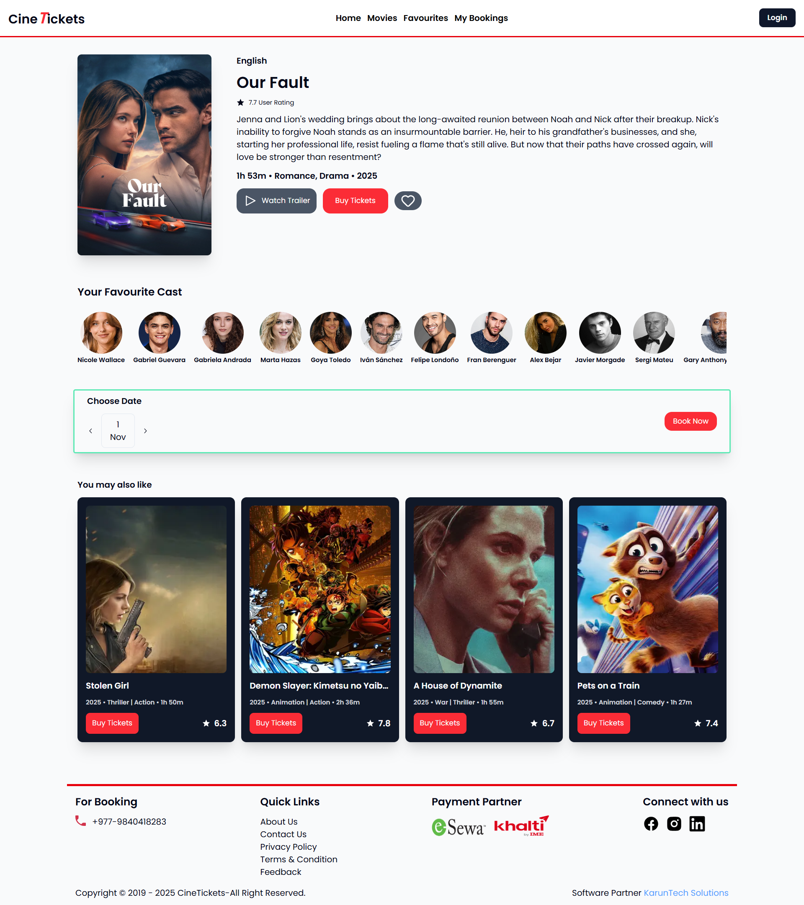
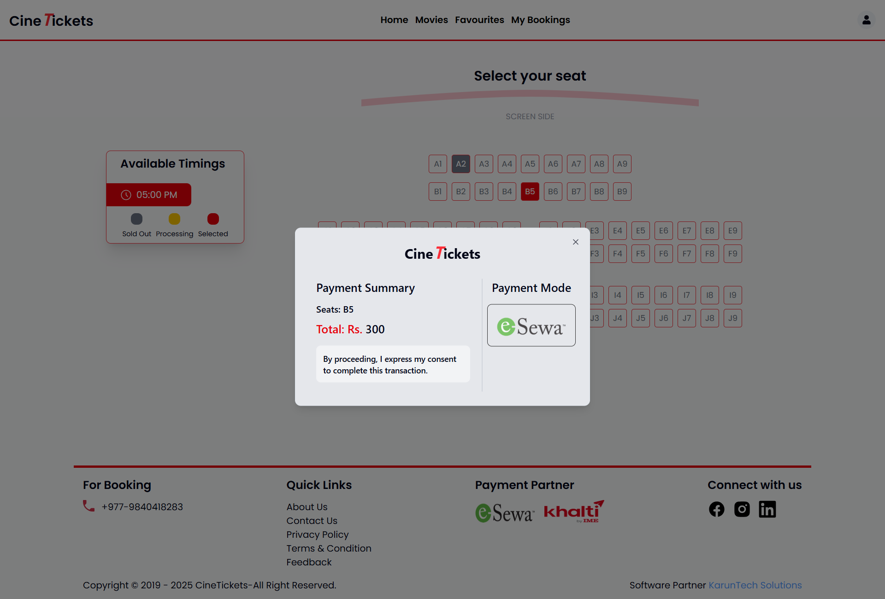

# 🎬 CineTickets - Your Gateway to the Big Screen
Visit the website: [CineTickets] https://cinetickets.vercel.app/
## 🖼️ Screenshots

---

## 🧠 Project Overview
**CineTicket** is a full-stack web application for booking movie tickets online.  
It provides real-time seat availability, secure online payments via **Esewa**, and fast response through **Redis caching** to prevent double bookings (race conditions).

---

## 🚀 Features
- 🎟️ **Real-time seat booking** with race condition prevention using Redis.
- 💳 **Esewa payment integration** for smooth online transactions.
- 🧾 **Booking confirmation & ticket download (PDF)**.
- 🔐 **Authentication** using **NextAuth (JWT strategy)**.
- 📅 **Movie scheduling and management dashboard**.
- ⚡ **Optimized performance** with caching and lazy loading.
- 🧭 **Responsive UI** for desktop and mobile users.

---

## 🛠️ Tech Stack
**Frontend:** Next.js, React, TailwindCSS  
**Backend:** Next.js  
**Database:** MongoDB  
**Caching:** Redis (Upstash)  
**Auth:** NextAuth.js (JWT)  
**Payment:** Esewa API

---

## 📊 Project Highlights in Numbers
- 🧩 **1** integrated online payment gateway (Esewa)  
- ⚡ **50% faster** response time with Redis caching  
- 🛑 **0** double-booking issues (race condition handled)  
- 💻 **100% responsive** UI  
- 🔄 **Secure JWT authentication** with role-based access

---

